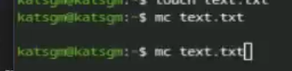
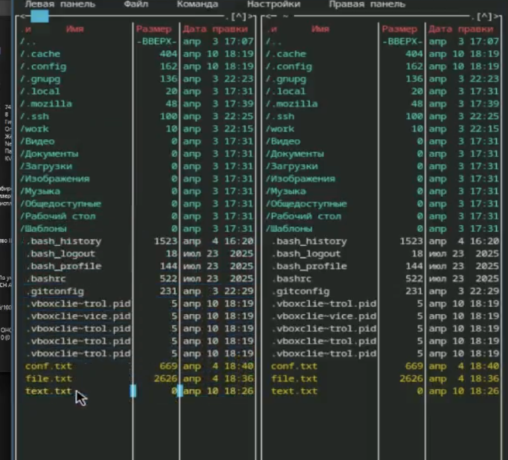
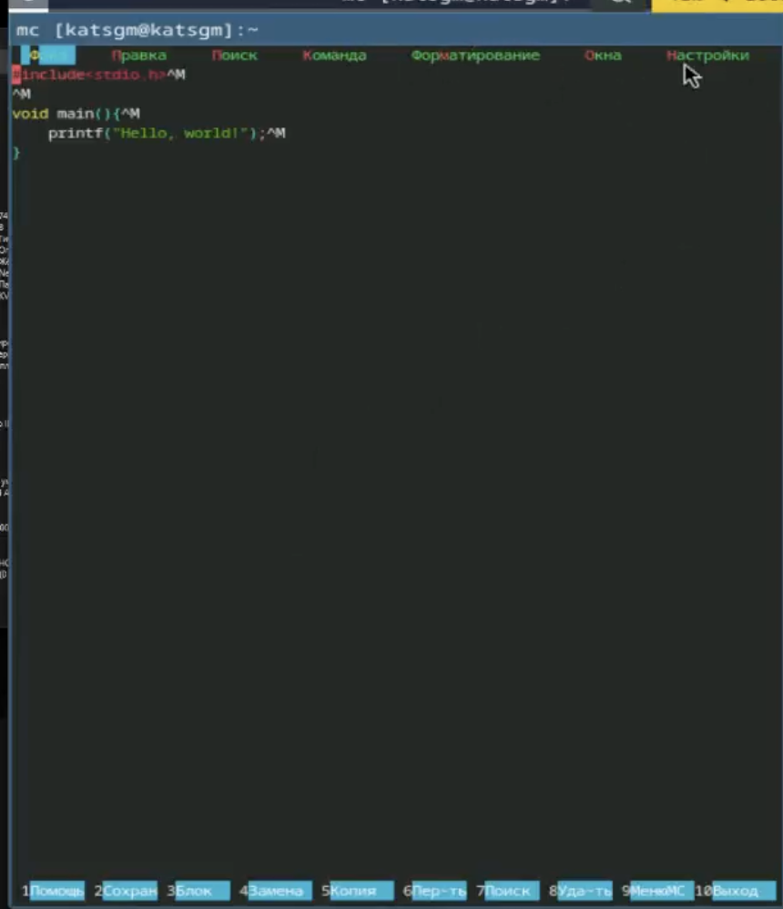
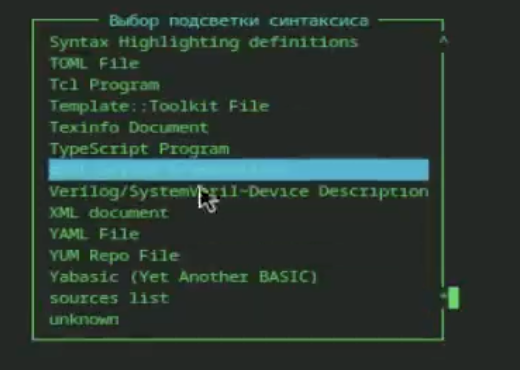
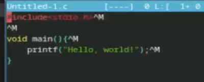

# Информация

## Докладчик

:::::::::::::: {.columns align=center}
::: {.column width="70%"}

  * Кац Григорий Михайлович
  * Студент НКАбд-03-25
  * Российский университет дружбы народов
  * [1032251955@rudn.ru](mailto:1032251955@rudn.ru)

:::

::::::::::::::

# Цель 

- Освоение основных возможностей командной оболочки Midnight Commander.
- Приобретение навыков практической работы по просмотру каталогов и файлов; манипуляций
с ними.

# Задание

1. Изучить основные возможности командной оболочки Midnight Commander.
2. Получить навыки практической работы по просмотру каталогов и файлов; манипуляций
с ними.

---

# Выполнение лабораторной работы

Изучаю информацию о mc, вызвав в командной строке man mc. (рис. 1)

{#fig-001 width=70%}

---

Запускаю из командной строки mc, изучаю его структуру и меню. (рис. 2)

{#fig-002 width=70%}

---

Выполняю несколько операций в mc, используя управляющие клавиши.
Создаю текстовой файл text.txt.

{#fig-003 width=70%}

---

5. Открываю этот файл с помощью f4.
6. Вставляю в открытый файл небольшой фрагмент текста.
7.1. Удаляю строку текста ctrl+y.
7.2. Выделяю фрагмент текста shift+-> и копирую его на новую строку f6.
7.3. Сохраняю файл f2.
7.4. Отменяю последнее действие ctrl+u.
7.5. Перехожу в конец файла ctrl+end.
7.6. Перехожу в начало файла ctrl+home.
7.7. Сохраняю f2 и закрываю файл f10.

---

8. Откройте файл с исходным текстом Markdown.
9. Используя меню редактора, включаю подсветку синтаксиса. 

{#fig-004 width=70%}

---

{#fig-005 width=70%}

---

## Контрольные вопросы

1. Режимы работы mc:  Две панели (стандартный),  Информация (свойства файла/ФС),  Дерево (дерево каталогов),  Отключённые панели (только shell).

2. Операции с файлами через shell и mc:  Shell: cp, mv, rm, mkdir.  mc: F5 (копирование), F6 (перемещение), F8 (удаление), F7 (создать каталог).

3. Структура меню Левой/Правой панели:  Список, быстрый просмотр, дерево, информация, формат вывода, сортировка, фильтр.

---

4. Структура меню Файл:  Просмотр (F3), правка (F4), копирование (F5), перемещение (F6), создание каталога (F7), удаление (F8),
 права доступа, ссылки, выход (F10).

5. Структура меню Команда:  Дерево каталогов, поиск файлов, перестановка панелей, сравнение каталогов, история команд,
 быстрые каталоги, восстановление файлов, правка файлов меню/расширений.

6. Структура меню Настройки:  Конфигурация панелей, внешний вид, набор символов, подтверждения, распознавание клавиш, виртуальная ФС.

---

7. Встроенные команды mc:  cd, cp, mv, mkdir, rm, pwd, find – через командную строку внутри mc.

8. Команды встроенного редактора mc:  Сохранить (F2), выйти (F10), удалить строку (Ctrl+y),
 копировать/вставить (F5/F6), поиск (F7), отмена (Ctrl+u), переходы (Ctrl+Home, Ctrl+End).

9. Средства для создания пользовательского меню:  Файл ~/.mc/menu – редактируется через меню Команда → Редактировать файл меню.

10. Средства для действий над текущим файлом:  Команды меню Файл, горячие клавиши (F3–F8), а также пользовательское меню (F2).

---

# Выводы

В ходе выполнения лабораторной работы были освоены основные возможности командной оболочки Midnight Commander. Приоб
ретены навыки практической работы по просмотру каталогов и файлов; манипуляций
с ними.

