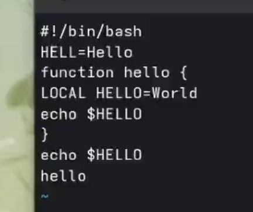

# Информация

## Докладчик

:::::::::::::: {.columns align=center}
::: {.column width="70%"}

  * Кац Григорий Михайлович
  * Студент НКАбд-03-25
  * Российский университет дружбы народов
  * [1032251955@rudn.ru](mailto:1032251955@rudn.ru)

:::

::::::::::::::

## Цель работы

- Познакомиться с операционной системой Linux.
- Получить практические навыки работы с редактором vi, установленным по умолчанию практически во всех дистрибутивах.

---

## Задание

- Познакомиться с операционной системой Linux.
- Получить практические навыки работы с редактором vi.

---

# Выполнение лабораторной работы

## Задание 1. Создание нового файла с использованием vi

1. Создаю каталог с именем ~/work/os/lab06.
2. Перехожу в созданный каталог.
3. Вызываю vi и создаю файл hello.sh

{#fig-001 width=70%}

---

4. Нажимаю клавишу i и ввожу текст.

{#fig-002 width=70%}

---

5. Нажимаю клавишу Esc для перехода в командный режим после завершения ввода
текста.
6. Нажмаю : для перехода в режим последней строки и внизу вашего экрана появится
приглашение в виде двоеточия.
7. Нажмаю w (записать) и q (выйти), а затем нажимаю клавишу Enter для сохранения
вашего текста и завершения работы.
8. Делаю файл исполняемым

{#fig-003 width=70%}

---

## Задание 2. Редактирование существующего файла

1. Вызываю vi на редактирование файла
2. Устанавливаю курсор в конец слова HELL второй строки.
3. Перехожу в режим вставки и заменяю на HELLO. Нажимаю Esc для возврата в команд-
ный режим.
4. Устанавливаю курсор на четвертую строку и стираю слово LOCAL.
5. Перехожу в режим вставки и набераю текст: local, нажимаю Esc для
возврата в командный режим.

---

6. Устанавливваю курсор на последней строке файла. Вставляю после неё строку, содержащую
следующий текст: echo $HELLO.
7. Нажимаю Esc для перехода в командный режим.
8. Удаляю последнюю строку.

---

9. Ввожу команду отмены изменений u для отмены последней команды.

{#fig-004 width=70%}

10. Ввожу символ : для перехода в режим последней строки. Записываю произведённые
изменения и выйдите из vi.

---

## Контрольные вопросы

1) Режимы vi:
командный (навигация/действия),
вставки (ввод текста),
последней строки (сохранение, выход, настройки).

2) Выйти без сохранения:
:q!

3) Команды позиционирования:
- 0 – начало строки
- $ – конец строки
- G – конец файла
- nG – строка n
- Ctrl+f/b – вперёд/назад на страницу

---

4) Слово в vi:
Последовательность букв, цифр, знаков подчёркивания, ограниченная пробелами, знаками препинания или переводом строки.

5) Переход в начало / конец файла:
 
Начало: gg или 1G
 
Конец: G
 
6) Группы команд редактирования:
 
вставка (i, a, o, O)
 
удаление (x, dw, dd, ndd)
 
отмена (u, U, Ctrl+r)
 
---

7) Заполнить строку символами $:
r – заменить один символ; для всей строки: cc → ввести $$$$... → Esc.
 
8) Отменить некорректное действие:
u – отмена последнего; U – отменить все изменения в строке.
9) Команды режима последней строки:
 
:w – записать
 
:q – выйти
 
:wq – сохранить и выйти
 
:q! – выйти без сохранения
 
:set nu – показать номера строк
 
10) Узнать позицию конца строки без курсора:
знак доллара перемещает курсор в конец строки;
также : set list показывает скрытые символы (включая знак доллара  в конце строки).
 
---

11) Анализ опций vi:
 
Команда :set all – полный список опций.
 
Примеры: nu (нумерация строк), ic (игнорировать регистр), list (отображать невидимые символы).
 
Отключение: :set nonu.
 
12) Определить режим работы:
 
Внизу экрана ничего (или сообщение после : ) – командный.
 
Внизу -- INSERT -- – режим вставки.
 
Внизу : – режим последней строки.
 
---
 
13) Граф взаимосвязи режимов (текстом):

Командный  --(i, a, o, O)--> Вставки

Вставки    --(Esc)---------> Командный

Командный  --( : )-----------> Последней строки

Последней строки --(Enter)--> Командный

---

# Выводы

В ходе выполнения лабораторной работы я познакомилась с операционной системой Linux и получила практические навыки работы с редактором vi.

Я научилась:

- Создавать и редактировать файлы в трёх режимах редактора (командном, вставки и последней строки)

- Выполнять основные операции: ввод текста, сохранение, выход, навигацию по файлу

- Использовать команды позиционирования, удаления, копирования и отмены изменений

- Делать файлы исполняемыми
