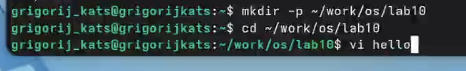
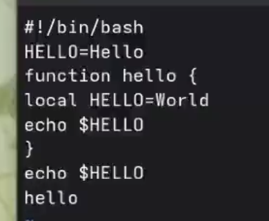

---
## Front matter
title: "Лабораторная работа №10"
author: "Кац Григорий Михайлович"

## Generic options
lang: ru-Ru\
toc-title: "Содержание"

## Bibliography
bibliography: bib/cite.bib
csl: pandoc/csl/gost-r-7-0-5-2008-numeric.csl

##Pdf output format
toc: true 
toc-depth: 2
lof: true
lot: true
fontsize: 12pt
linestretch: 1.5
papersize: a4
documentclass: scrreprt

polyglossia-lang:
   name: russian
   options:
   - spelling=modern
   - babelshorhands=true
polyglossia-otherlangs:
   name: english

babel-lang: russian
babel-otherlangs: english
mainfont: Times New Roman
sansfont: Arial
monofont: Courier New
mathfont: Times New Roman

biblatex: true
biblio-style: "gost-numeric"
biblatexoptions:
    - parentracker=true
    - backend=biber
    - hyperref=auto
    - language=auto
    - autolang=other*
    - citestyle=gost-numeric

igureTitle: "Рис."
tableTitle: "Таблица"
listingTitle: "Листинг"
lofTitle: "Список иллюстраций"
lotTitle: "Список таблиц"
lolTitle: "Листинги"

indent: true
header-includes:
  - \usepackage{indentfirst}
  - \usepackage{float} 
  - \floatplacement{figure}{H} 
---

# Цель работы

Познакомиться с операционной системой Linux. Получить практические навыки работы
 с редактором vi, установленным по умолчанию практически во всех дистрибутивах.

# Задание

- Познакомиться с операционной системой Linux.
- Получить практические навыки работы с редактором vi.

# Теоретическое введение

В большинстве дистрибутивов Linux в качестве текстового редактора по умолчанию
устанавливается интерактивный экранный редактор vi (Visual display editor).
Редактор vi имеет три режима работы:
– командный режим — предназначен для ввода команд редактирования и навигации по
редактируемому файлу;
– режим вставки — предназначен для ввода содержания редактируемого файла;
– режим последней (или командной) строки — используется для записи изменений в файл
и выхода из редактора.
Для вызова редактора vi необходимо указать команду vi и имя редактируемого файла:
vi <имя_файла>
При этом в случае отсутствия файла с указанным именем будет создан такой файл.
Переход в командный режим осуществляется нажатием клавиши Esc . Для выхода из
редактора vi необходимо перейти в режим последней строки: находясь в командном
режиме, нажать Shift-; (по сути символ : — двоеточие), затем:
– набрать символы wq, если перед выходом из редактора требуется записать изменения
в файл;
– набрать символ q (или q!), если требуется выйти из редактора без сохранения.

# Выполнение лабораторной работы

## Задание 1. Создание нового файла с использованием vi

1. Создаю каталог с именем ~/work/os/lab06.
2. Перехожу в созданный каталог.
3. Вызываю vi и создаю файл hello.sh

{#fig-001 width=70%}

4. Нажимаю клавишу i и ввожу текст.

{#fig-002 width=70%}

5. Нажимаю клавишу Esc для перехода в командный режим после завершения ввода
текста.
6. Нажмаю : для перехода в режим последней строки и внизу вашего экрана появится
приглашение в виде двоеточия.
7. Нажмаю w (записать) и q (выйти), а затем нажимаю клавишу Enter для сохранения
вашего текста и завершения работы.
8. Делаю файл исполняемым

{#fig-003 width=70%}

## Задание 2. Редактирование существующего файла

1. Вызываю vi на редактирование файла
2. Устанавливаю курсор в конец слова HELL второй строки.
3. Перехожу в режим вставки и заменяю на HELLO. Нажимаю Esc для возврата в команд-
ный режим.
4. Устанавливаю курсор на четвертую строку и стираю слово LOCAL.
5. Перехожу в режим вставки и набераю текст: local, нажимаю Esc для
возврата в командный режим.
6. Устанавливваю курсор на последней строке файла. Вставляю после неё строку, содержащую
следующий текст: echo $HELLO.
7. Нажимаю Esc для перехода в командный режим.
8. Удаляю последнюю строку.
9. Ввожу команду отмены изменений u для отмены последней команды.

{#fig-004 width=70%}

10. Ввожу символ : для перехода в режим последней строки. Записываю произведённые
изменения и выйдите из vi.
## Контрольные вопросы

1) Режимы vi:
командный (навигация/действия),
вставки (ввод текста),
последней строки (сохранение, выход, настройки).

2) Выйти без сохранения:
:q!

3) Команды позиционирования:
- 0 – начало строки
- $ – конец строки
- G – конец файла
- nG – строка n
- Ctrl+f/b – вперёд/назад на страницу

4) Слово в vi:
Последовательность букв, цифр, знаков подчёркивания, ограниченная пробелами, знаками препинания или переводом строки.

5) Переход в начало / конец файла:
 
Начало: gg или 1G
 
Конец: G
 
6) Группы команд редактирования:
 
вставка (i, a, o, O)
 
удаление (x, dw, dd, ndd)
 
отмена (u, U, Ctrl+r)
 
7) Заполнить строку символами $:
r – заменить один символ; для всей строки: cc → ввести $$$$... → Esc.
 
8) Отменить некорректное действие:
u – отмена последнего; U – отменить все изменения в строке.
 
9) Команды режима последней строки:
 
:w – записать
 
:q – выйти
 
:wq – сохранить и выйти
 
:q! – выйти без сохранения
 
:set nu – показать номера строк
 
10) Узнать позицию конца строки без курсора:
знак доллара перемещает курсор в конец строки;
также : set list показывает скрытые символы (включая знак доллара в конце строки).
 
11) Анализ опций vi:
 
Команда :set all – полный список опций.
 
Примеры: nu (нумерация строк), ic (игнорировать регистр), list (отображать невидимые символы).
 
Отключение: :set nonu.
 
12) Определить режим работы:
 
Внизу экрана ничего (или сообщение после ":" ) – командный.
 
Внизу -- INSERT -- – режим вставки.
 
Внизу : – режим последней строки.
 
13) Граф взаимосвязи режимов (текстом):

Командный  --(i, a, o, O)--> Вставки

Вставки    --(Esc)---------> Командный

Командный  --( : )-----------> Последней строки

Последней строки --(Enter)--> Командный

# Выводы

В ходе выполнения лабораторной работы получены практические навыки работы с редактором vi.

# Список литературы{.unnumbered}

::: {#refs}
:::
