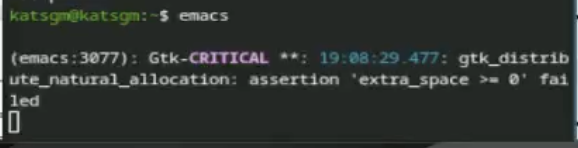
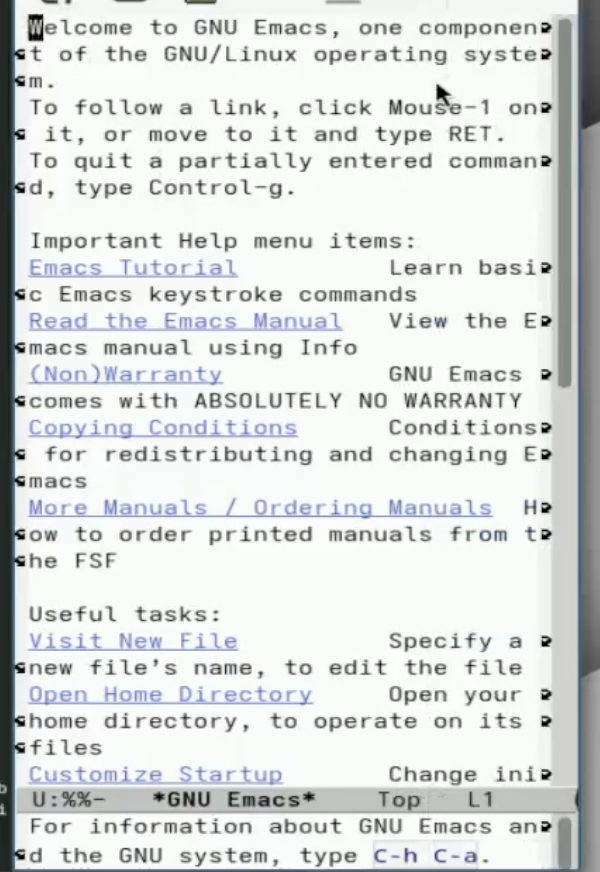
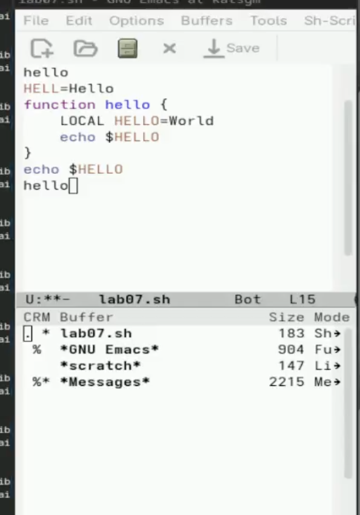
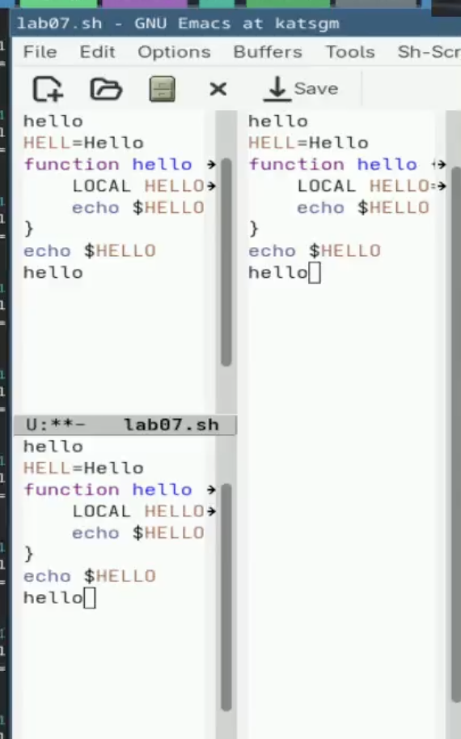

# Информация

## Докладчик

:::::::::::::: {.columns align=center}
::: {.column width="70%"}

  * Кац Григорий Михайлович
  * Студент НКАбд-03-25
  * Российский университет дружбы народов
  * [1032251955@rudn.ru](mailto:1032251955@rudn.ru)

:::

::::::::::::::

# Вводная часть

## Цель работы

- Познакомиться с операционной системой Linux.
- Получить практические навыки работы с редактором Emacs.

---

## Задание

- Знакомство с операционной системой Linux.
- Получение практических навыков работы с редактором Emacs.

---

# Выполнение лабораторной работы

1. Открываю emacs.

{#fig-001 width=70%}

---

2. Создаю файл lab11.sh с помощью комбинации Ctrl-x Ctrl-f (C-x C-f).([рис. @fig-002]).

{#fig-002 width=70%}

---

3. Набераю текст 

{#fig-003 width=70%}

4. Сохраняю файл с помощью комбинации Ctrl-x Ctrl-s (C-x C-s).
---

5. Проделываю с текстом стандартные процедуры редактирования, с помощью комбинацией клавиш.
5.1. Вырезаю одной командой целую строку (С-k).
5.2. Вставляю эту строку (C-y).
5.3. Выделяю область текста (C-space).
5.4. Копировать область в буфер обмена (M-w).
5.5. Вставляю область в конец файла.

---

6. Использую команды по перемещению курсора.
6.1. Переместите курсор в начало строки (C-a).
6.2. Переместите курсор в конец строки (C-e).
6.3. Переместите курсор в начало буфера (M-<).
6.4. Переместите курсор в конец буфера (M->).
---

7. Управление буферами.

{#fig-004 width=70%}

---

7.1. Вывести список активных буферов на экран (C-x C-b).
7.2. Переместитесь во вновь открытое окно (C-x) o со списком открытых буферов
и переключитесь на другой буфер.
7.3. Закройте это окно (C-x 0).
7.4. Теперь вновь переключайтесь между буферами, но уже без вывода их списка на
экран (C-x b).

---

8. Управление окнами ([рис. @fig-005]).

{#fig-005 width=70%}

---

9. Режим поиска
9.1. Переключаюсь в режим поиска (C-s) и найхожу несколько слов, присутствующихв тексте.
9.2. Переключаюсь между результатами поиска, нажимая C-s.
9.3. Выхлжу из режима поиска, нажав C-g.

---

## Контрольные вопросы

1. Кратко охарактеризуйте редактор Emacs.
Emacs — мощный расширяемый текстовый редактор с поддержкой множества режимов, написанный на Elisp.

2. Какие особенности могут сделать Emacs сложным для новичков?
Множество комбинаций клавиш, непривычная терминология, высокая настраиваемость.

3. Что такое буфер и окно в Emacs?
Буфер — область памяти с текстом. Окно — область экрана, отображающая буфер.

---

4. Можно ли открыть больше 10 буферов в одном окне?
Да, количество буферов не ограничено.

5. Какие буферы создаются по умолчанию при запуске Emacs?
*scratch*, *Messages*, *GNU Emacs*.

6. Как ввести комбинации C-c | и C-c C-|?
C-c | = Ctrl + c, затем Shift + \
C-c C-| = Ctrl + c, затем Ctrl + Shift + \

7. Как разделить текущее окно на две части?
C-x 2 (горизонтально), C-x 3 (вертикально).

---

8. Где хранятся настройки Emacs?
В файле ~/.emacs или ~/.emacs.d/init.el.

9. Можно ли переназначить клавиши?
Да, через global-set-key.

10. Какой редактор удобнее — vi или Emacs?
Ответ субъективен. Emacs удобнее для программирования и интеграции, vi — для быстрого редактирования в терминале.

---

# Выводы

В ходе выполнения лабораторной работы познакомился с операционной системой Linux, получил практические навыки работы с редактором Emacs.

